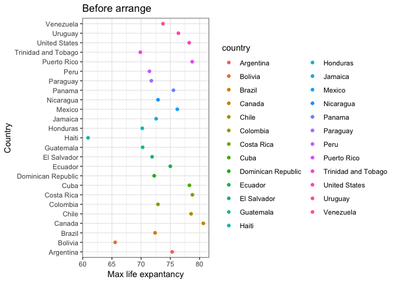
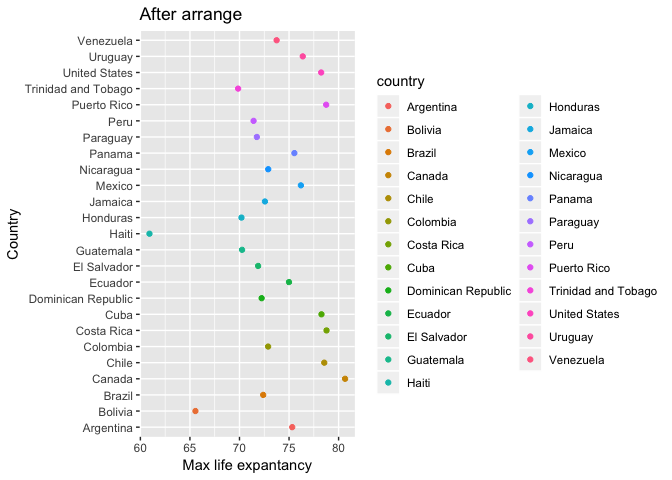

hw05
================
ziqiangt
2018/10/16

Overview
--------

Goals:

-   Reorder a factor in a principled way based on the data and demonstrate the effect in arranged data and in figures.
-   Write some data to file and load it back into R.
-   Improve a figure (or make one from scratch), using new knowledge, e.g., control the color scheme, use factor levels, smoother mechanics.
-   Make a plotly visual.
-   Implement visualization design principles.

let's first library all dataset:

``` r
library(gapminder)
library(tidyverse)
```

    ## -- Attaching packages --------------------------------------- tidyverse 1.2.1 --

    ## <U+221A> ggplot2 3.0.0     <U+221A> purrr   0.2.5
    ## <U+221A> tibble  1.4.2     <U+221A> dplyr   0.7.6
    ## <U+221A> tidyr   0.8.1     <U+221A> stringr 1.3.1
    ## <U+221A> readr   1.1.1     <U+221A> forcats 0.3.0

    ## -- Conflicts ------------------------------------------ tidyverse_conflicts() --
    ## x dplyr::filter() masks stats::filter()
    ## x dplyr::lag()    masks stats::lag()

``` r
library(knitr)
library(plotly)
```

    ## 
    ## Attaching package: 'plotly'

    ## The following object is masked from 'package:ggplot2':
    ## 
    ##     last_plot

    ## The following object is masked from 'package:stats':
    ## 
    ##     filter

    ## The following object is masked from 'package:graphics':
    ## 
    ##     layout

The Assignment
--------------

### Part 1: Factor management

#### Before drop Oceania

let's first view the structure of the dataset:

``` r
gapminder %>% 
  summarize(
    nrow = nrow(gapminder),
    nlevels = nlevels(gapminder$country),
    nlevels2 = nlevels(gapminder$continent)) %>% 
  knitr::kable(col.names = c("Rows", "Levels of country", "Levels of continent"))
```

|  Rows|  Levels of country|  Levels of continent|
|-----:|------------------:|--------------------:|
|  1704|                142|                    5|

It can be seen that the total number of rows in the data.frame is 1704. 'Country' and 'continent' are both factors with 142 and 5 levels respectively.

#### Drop Oceania;

``` r
no_oceania <- gapminder %>%
  filter(continent != "Oceania") # filter the Oceania
  
no_oceania %>% 
  summarize(
    nrow = nrow(no_oceania),
    nlevels = nlevels(no_oceania$country),
    nlevels2 = nlevels(no_oceania$continent)) %>% 
  knitr::kable(col.names = c("Rows_filtered", "Levels of country_filtered", "Levels of continent_filtered"))
```

|  Rows\_filtered|  Levels of country\_filtered|  Levels of continent\_filtered|
|---------------:|----------------------------:|------------------------------:|
|            1680|                          142|                              5|

It can be seen that the total number of rows in the data.frame has droped from the orginal 1704 to 1680. However, the levels was not droped. Therefore, we need to investigate the function 'droplevels()'.

``` r
no_oceania_drop_level <- no_oceania %>%
  droplevels()

no_oceania_drop_level %>% 
  summarize(
    nrow = nrow(no_oceania_drop_level),
    nlevels = nlevels(no_oceania_drop_level$country),
    nlevels2 = nlevels(no_oceania_drop_level$continent)) %>% 
  knitr::kable(col.names = c("Rows_drop", "Levels of country_drop", "Levels of continent_drop"))
```

|  Rows\_drop|  Levels of country\_drop|  Levels of continent\_drop|
|-----------:|------------------------:|--------------------------:|
|        1680|                      140|                          4|

It can be seen that the levels has droped from the orginal 1704 to 1680. However, the levels 'country' and 'continent' has been droped to 140 (originally 142) and 4 (originally 5) levels respectively.

With the help of mutate, we could restrict which levels to drop.

``` r
no_oceania_fct_drop <- no_oceania %>%
  mutate(continent = droplevels(continent))

no_oceania_drop_level %>% 
  summarize(
    nrow = nrow(no_oceania_fct_drop),
    nlevels = nlevels(no_oceania_fct_drop$country),
    nlevels2 = nlevels(no_oceania_fct_drop$continent)) %>% 
  knitr::kable(col.names = c("Rows_drop", "Levels of country_drop", "Levels of continent_drop"))
```

|  Rows\_drop|  Levels of country\_drop|  Levels of continent\_drop|
|-----------:|------------------------:|--------------------------:|
|        1680|                      142|                          4|

### Reorder the levels of country and continent

#### the effects of arrange

``` r
before_arrange <- gapminder %>%
  filter(continent == "Americas") %>% 
  group_by(country) %>% 
  mutate(max_life = max(lifeExp)) %>% # calcuate maximum lifeExp for each country
  select(country, max_life) %>% 
  unique() # delete the repeat rows

kable(head( before_arrange, 10 )) # view the first 10 rows
```

| country            |  max\_life|
|:-------------------|----------:|
| Argentina          |     75.320|
| Bolivia            |     65.554|
| Brazil             |     72.390|
| Canada             |     80.653|
| Chile              |     78.553|
| Colombia           |     72.889|
| Costa Rica         |     78.782|
| Cuba               |     78.273|
| Dominican Republic |     72.235|
| Ecuador            |     74.994|

#### the effects of arrange

``` r
after_arrange <- before_arrange %>% 
  arrange(max_life)

kable(head( after_arrange, 10 )) # view the first 10 rows
```

| country             |  max\_life|
|:--------------------|----------:|
| Haiti               |     60.916|
| Bolivia             |     65.554|
| Trinidad and Tobago |     69.862|
| Honduras            |     70.198|
| Guatemala           |     70.259|
| Peru                |     71.421|
| Paraguay            |     71.752|
| El Salvador         |     71.878|
| Dominican Republic  |     72.235|
| Brazil              |     72.390|

It can be seen that the arrange does have effect on table. But how about the figures?

``` r
before_arrange %>% 
  ggplot( aes( x = max_life, y = country, color = country )) +
  geom_point() +
  ggtitle( "Before arrange" ) +
  xlab( "Max life expantancy") +
  ylab( "Country" ) +
  theme_bw()  #change theme
```



``` r
after_arrange %>% 
  ggplot( aes( x = max_life, y = country, color = country )) +
  geom_point() +
  ggtitle( "After arrange" ) +
  xlab( "Max life expantancy") +
  ylab( "Country" ) +
  theme_gray()  #change theme
```



It is easily can be seen that the arrange has no effect on figures. Let us try the fucntion fct\_reorder().

``` r
before_arrange %>% 
  ggplot( aes( x = max_life, y = fct_reorder(country, max_life), color = country )) +
  geom_point() +
  ggtitle( "After fct_reorder" ) +
  xlab( "Max life expantancy") +
  ylab( "Country" ) +
  theme_dark()  #change theme
```


Conclusions: using arrange() along will not affect the order of levels while fct\_reorcer() does.

### Part 2: File I/O
