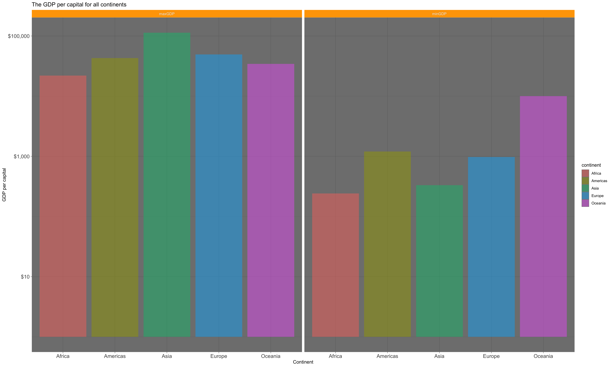

hw05
================
ziqiangt
2018/10/16

Overview
--------

Goals:

-   Reorder a factor in a principled way based on the data and demonstrate the effect in arranged data and in figures.
-   Write some data to file and load it back into R.
-   Improve a figure (or make one from scratch), using new knowledge, e.g., control the color scheme, use factor levels, smoother mechanics.
-   Make a plotly visual.
-   Implement visualization design principles.

let's first library all dataset:

``` r
library(gapminder)
library(tidyverse)
```

    ## -- Attaching packages --------------------------------------- tidyverse 1.2.1 --

    ## <U+221A> ggplot2 3.0.0     <U+221A> purrr   0.2.5
    ## <U+221A> tibble  1.4.2     <U+221A> dplyr   0.7.6
    ## <U+221A> tidyr   0.8.1     <U+221A> stringr 1.3.1
    ## <U+221A> readr   1.1.1     <U+221A> forcats 0.3.0

    ## -- Conflicts ------------------------------------------ tidyverse_conflicts() --
    ## x dplyr::filter() masks stats::filter()
    ## x dplyr::lag()    masks stats::lag()

``` r
library(knitr)
library(plotly)
```

    ## 
    ## Attaching package: 'plotly'

    ## The following object is masked from 'package:ggplot2':
    ## 
    ##     last_plot

    ## The following object is masked from 'package:stats':
    ## 
    ##     filter

    ## The following object is masked from 'package:graphics':
    ## 
    ##     layout

``` r
suppressPackageStartupMessages(library(tidyverse))
library(scales)
```

    ## 
    ## Attaching package: 'scales'

    ## The following object is masked from 'package:purrr':
    ## 
    ##     discard

    ## The following object is masked from 'package:readr':
    ## 
    ##     col_factor

The Assignment
--------------

### Part 1: Factor management

| Function        | Definition                              |
|-----------------|-----------------------------------------|
| `droplevels()`  | drop unused levels                      |
| `arrange()`     | no effects on the order of levels pairs |
| `fct_reorcer()` | affect on the order of levels pairs     |

#### Before drop Oceania

let's first view the structure of the dataset:

``` r
gapminder %>% 
  summarize(
    nrow = nrow(gapminder),
    nlevels = nlevels(gapminder$country),
    nlevels2 = nlevels(gapminder$continent)) %>% 
  knitr::kable(col.names = c("Rows", "Levels of country", "Levels of continent"))
```

|  Rows|  Levels of country|  Levels of continent|
|-----:|------------------:|--------------------:|
|  1704|                142|                    5|

It can be seen that the total number of rows in the data.frame is 1704. 'Country' and 'continent' are both factors with 142 and 5 levels respectively.

#### Drop Oceania;

``` r
no_oceania <- gapminder %>%
  filter(continent != "Oceania") # filter the Oceania
  
no_oceania %>% 
  summarize(
    nrow = nrow(no_oceania),
    nlevels = nlevels(no_oceania$country),
    nlevels2 = nlevels(no_oceania$continent)) %>% 
  knitr::kable(col.names = c("Rows_filtered", "Levels of country_filtered", "Levels of continent_filtered"))
```

|  Rows\_filtered|  Levels of country\_filtered|  Levels of continent\_filtered|
|---------------:|----------------------------:|------------------------------:|
|            1680|                          142|                              5|

It can be seen that the total number of rows in the data.frame has droped from the orginal 1704 to 1680. However, the levels was not droped. Therefore, we need to investigate the function 'droplevels()'.

``` r
no_oceania_drop_level <- no_oceania %>%
  droplevels()

no_oceania_drop_level %>% 
  summarize(
    nrow = nrow(no_oceania_drop_level),
    nlevels = nlevels(no_oceania_drop_level$country),
    nlevels2 = nlevels(no_oceania_drop_level$continent)) %>% 
  knitr::kable(col.names = c("Rows_drop", "Levels of country_drop", "Levels of continent_drop"))
```

|  Rows\_drop|  Levels of country\_drop|  Levels of continent\_drop|
|-----------:|------------------------:|--------------------------:|
|        1680|                      140|                          4|

It can be seen that the levels has droped from the orginal 1704 to 1680. However, the levels 'country' and 'continent' has been droped to 140 (originally 142) and 4 (originally 5) levels respectively.

With the help of mutate, we could restrict which levels to drop.

``` r
no_oceania_fct_drop <- no_oceania %>%
  mutate(continent = droplevels(continent))

no_oceania_drop_level %>% 
  summarize(
    nrow = nrow(no_oceania_fct_drop),
    nlevels = nlevels(no_oceania_fct_drop$country),
    nlevels2 = nlevels(no_oceania_fct_drop$continent)) %>% 
  knitr::kable(col.names = c("Rows_drop", "Levels of country_drop", "Levels of continent_drop"))
```

|  Rows\_drop|  Levels of country\_drop|  Levels of continent\_drop|
|-----------:|------------------------:|--------------------------:|
|        1680|                      142|                          4|

### Reorder the levels of country and continent

#### the effects of arrange

``` r
before_arrange <- gapminder %>%
  filter(continent == "Americas") %>% 
  group_by(country) %>% 
  mutate(max_life = max(lifeExp)) %>% # calcuate maximum lifeExp for each country
  select(country, max_life) %>% 
  unique() # delete the repeat rows

kable(head( before_arrange, 10 )) # view the first 10 rows
```

| country            |  max\_life|
|:-------------------|----------:|
| Argentina          |     75.320|
| Bolivia            |     65.554|
| Brazil             |     72.390|
| Canada             |     80.653|
| Chile              |     78.553|
| Colombia           |     72.889|
| Costa Rica         |     78.782|
| Cuba               |     78.273|
| Dominican Republic |     72.235|
| Ecuador            |     74.994|

#### the effects of arrange

``` r
after_arrange <- before_arrange %>% 
  arrange(max_life)

kable(head( after_arrange, 10 )) # view the first 10 rows
```

| country             |  max\_life|
|:--------------------|----------:|
| Haiti               |     60.916|
| Bolivia             |     65.554|
| Trinidad and Tobago |     69.862|
| Honduras            |     70.198|
| Guatemala           |     70.259|
| Peru                |     71.421|
| Paraguay            |     71.752|
| El Salvador         |     71.878|
| Dominican Republic  |     72.235|
| Brazil              |     72.390|

It can be seen that the arrange does have effect on table. But how about the figures?

``` r
before_arrange %>% 
  ggplot( aes( x = max_life, y = country, color = country )) +
  geom_point() +
  ggtitle( "Before arrange" ) +
  xlab( "Max life expantancy") +
  ylab( "Country" ) +
  theme_bw()  #change theme
```


``` r
after_arrange %>% 
  ggplot( aes( x = max_life, y = country, color = country )) +
  geom_point() +
  ggtitle( "After arrange" ) +
  xlab( "Max life expantancy") +
  ylab( "Country" ) +
  theme_gray()  #change theme
```


It is easily can be seen that the arrange has no effect on figures. Let us try the fucntion fct\_reorder().

``` r
before_arrange %>% 
  ggplot( aes( x = max_life, y = fct_reorder(country, max_life), color = country )) +
  geom_point() +
  ggtitle( "After fct_reorder" ) +
  xlab( "Max life expantancy") +
  ylab( "Country" ) +
  theme_dark()  #change theme
```


Conclusions: using arrange() along will not affect the order of levels while fct\_reorcer() does.

### Part 2: File I/O

<table style="width:50%;">
<colgroup>
<col width="23%" />
<col width="26%" />
</colgroup>
<thead>
<tr class="header">
<th>Function</th>
<th>Definition</th>
</tr>
</thead>
<tbody>
<tr class="odd">
<td><code>write_csv()/read_csv()</code></td>
<td>Write/Read a data frame to a delimited file while parse each column with default formats</td>
</tr>
<tr class="even">
<td><code>saveRDS()/readRDS()</code></td>
<td>Write/Read a single R object to a file and keep the original formats</td>
</tr>
<tr class="odd">
<td><code>dput()/dget()</code></td>
<td>Writes/Read an ASCII text representation of an R object to a file and keep the original formats</td>
</tr>
</tbody>
</table>

Let's example the part 1 data with the above functions. First, let's recall the dataset- before\_arrange:

``` r
kable( head( before_arrange, 10 )) 
```

| country            |  max\_life|
|:-------------------|----------:|
| Argentina          |     75.320|
| Bolivia            |     65.554|
| Brazil             |     72.390|
| Canada             |     80.653|
| Chile              |     78.553|
| Colombia           |     72.889|
| Costa Rica         |     78.782|
| Cuba               |     78.273|
| Dominican Republic |     72.235|
| Ecuador            |     74.994|

``` r
glimpse( before_arrange) # just for learning the function glimpse
```

    ## Observations: 25
    ## Variables: 2
    ## $ country  <fct> Argentina, Bolivia, Brazil, Canada, Chile, Colombia, ...
    ## $ max_life <dbl> 75.320, 65.554, 72.390, 80.653, 78.553, 72.889, 78.78...

#### write\_csv()/read\_csv()

``` r
write_csv(before_arrange, "data_csv.csv") # write to csv
read_data_csv <- read_csv("data_csv.csv") # read from csv
```

    ## Parsed with column specification:
    ## cols(
    ##   country = col_character(),
    ##   max_life = col_double()
    ## )

``` r
read_back <- glimpse(read_data_csv) 
```

    ## Observations: 25
    ## Variables: 2
    ## $ country  <chr> "Argentina", "Bolivia", "Brazil", "Canada", "Chile", ...
    ## $ max_life <dbl> 75.320, 65.554, 72.390, 80.653, 78.553, 72.889, 78.78...

``` r
if(read_data_csv == before_arrange) # judge the store data is correct or not
  ("Read back data Match with data before storing!")
```

    ## Warning in if (read_data_csv == before_arrange) ("Read back data Match with
    ## data before storing!"): the condition has length > 1 and only the first
    ## element will be used

    ## [1] "Read back data Match with data before storing!"

It should be noted that after read\_csv, the class of country has changed from the original <fct> to <chr> while the if cannot distinguish this difference.

#### saveRDS()/readRDS()

``` r
saveRDS(before_arrange, "data_csv.csv") # write to csv
read_data_RDS <- readRDS("data_csv.csv") # read from csv
glimpse(read_data_RDS) 
```

    ## Observations: 25
    ## Variables: 2
    ## $ country  <fct> Argentina, Bolivia, Brazil, Canada, Chile, Colombia, ...
    ## $ max_life <dbl> 75.320, 65.554, 72.390, 80.653, 78.553, 72.889, 78.78...

By using saveRDS()/readRDS(), the class can be kept to be the same as the original format.

#### dput()/dget()

``` r
dput(before_arrange, "data_csv.csv") # write to csv
read_data_dget <- dget("data_csv.csv") # read from csv
glimpse(read_data_dget) 
```

    ## Observations: 25
    ## Variables: 2
    ## $ country  <fct> Argentina, Bolivia, Brazil, Canada, Chile, Colombia, ...
    ## $ max_life <dbl> 75.320, 65.554, 72.390, 80.653, 78.553, 72.889, 78.78...

Similarly as saveRDS()/readRDS(), the class can be kept to be the same as the original format.

### Part 3: Visualization design

Here is what I did in assignment 03. I want to show the maximum and minimum of GDP per capital for all continents.

``` r
GDP_per_cap <- gapminder %>% 
  group_by( continent ) %>% 
  summarize( minGDP = min( gdpPercap ),
            maxGDP = max( gdpPercap ))
GDP_per_cap %>% 
gather( key = min_or_max, value = GDP_per_cap, 2:3 ) %>%  
  ggplot( aes( x = continent, y = GDP_per_cap, fill = continent )) +
  geom_col( alpha = 0.5 ) +
  scale_y_log10() +
  facet_wrap( .~min_or_max )  +
  ggtitle( "The GDP per capital for all continents" ) +
  xlab( "Continent") +
  ylab( "GDP per capital" )
```


It can seen the y-axis is reall hard to know the exact meaning. Therefore, let's change to dollar\_format(). Besides, we could change the strip.background to have a more clear view. Moreover, the test size could also be ajusted.

``` r
Df_GDP_per_cap <- gapminder %>% 
  group_by( continent ) %>% 
  summarize( minGDP = min( gdpPercap ),
            maxGDP = max( gdpPercap ))

plot_new <- Df_GDP_per_cap %>% 
gather( key = min_or_max, value = Df_GDP_per_cap, 2:3 ) %>%  
  ggplot( aes( x = continent, y = Df_GDP_per_cap, fill = continent )) +
  geom_col( alpha = 0.5 ) +
  scale_y_log10(labels=dollar_format()) + #change to dollar format
  facet_wrap( .~min_or_max )  +
  ggtitle( "The GDP per capital for all continents" ) +
  xlab( "Continent") +
  ylab( "GDP per capital" ) +
  theme_dark() +                          #change theme 
  theme(axis.text =  element_text(size = 12),
          strip.background = element_rect(fill = "orange"))

plot_new
```


plotly VS ggplot: Plotly and ggplot2 are inherently for different purposes. plotly allows you to quickly create beautiful, reactive D3 plots that are particularly powerful in websites and dashboards. You can hover your mouse over the plots and see the data values, zoom in and out of specific regions, and capture stills.

``` r
ggplotly(plot_new)
```

<!--html_preserve-->

<script type="application/json" data-for="htmlwidget-83eb2a799f5fd24834d3">{"x":{"data":[{"orientation":"v","width":0.9,"base":0,"x":[1],"y":[4.34145849934605],"text":"continent: Africa<br />Df_GDP_per_cap:  21951.2118<br />continent: Africa","type":"bar","marker":{"autocolorscale":false,"color":"rgba(248,118,109,0.5)","line":{"width":1.88976377952756,"color":"transparent"}},"name":"Africa","legendgroup":"Africa","showlegend":true,"xaxis":"x","yaxis":"y","hoverinfo":"text","frame":null},{"orientation":"v","width":0.9,"base":0,"x":[1],"y":[2.38231585779586],"text":"continent: Africa<br />Df_GDP_per_cap:    241.1659<br />continent: Africa","type":"bar","marker":{"autocolorscale":false,"color":"rgba(248,118,109,0.5)","line":{"width":1.88976377952756,"color":"transparent"}},"name":"Africa","legendgroup":"Africa","showlegend":false,"xaxis":"x2","yaxis":"y","hoverinfo":"text","frame":null},{"orientation":"v","width":0.9,"base":0,"x":[2],"y":[4.632979883279],"text":"continent: Americas<br />Df_GDP_per_cap:  42951.6531<br />continent: Americas","type":"bar","marker":{"autocolorscale":false,"color":"rgba(163,165,0,0.5)","line":{"width":1.88976377952756,"color":"transparent"}},"name":"Americas","legendgroup":"Americas","showlegend":true,"xaxis":"x","yaxis":"y","hoverinfo":"text","frame":null},{"orientation":"v","width":0.9,"base":0,"x":[2],"y":[3.0797733480287],"text":"continent: Americas<br />Df_GDP_per_cap:   1201.6372<br />continent: Americas","type":"bar","marker":{"autocolorscale":false,"color":"rgba(163,165,0,0.5)","line":{"width":1.88976377952756,"color":"transparent"}},"name":"Americas","legendgroup":"Americas","showlegend":false,"xaxis":"x2","yaxis":"y","hoverinfo":"text","frame":null},{"orientation":"v","width":0.9,"base":0,"x":[3],"y":[5.05508436784766],"text":"continent: Asia<br />Df_GDP_per_cap: 113523.1329<br />continent: Asia","type":"bar","marker":{"autocolorscale":false,"color":"rgba(0,191,125,0.5)","line":{"width":1.88976377952756,"color":"transparent"}},"name":"Asia","legendgroup":"Asia","showlegend":true,"xaxis":"x","yaxis":"y","hoverinfo":"text","frame":null},{"orientation":"v","width":0.9,"base":0,"x":[3],"y":[2.51982799377572],"text":"continent: Asia<br />Df_GDP_per_cap:    331.0000<br />continent: Asia","type":"bar","marker":{"autocolorscale":false,"color":"rgba(0,191,125,0.5)","line":{"width":1.88976377952756,"color":"transparent"}},"name":"Asia","legendgroup":"Asia","showlegend":false,"xaxis":"x2","yaxis":"y","hoverinfo":"text","frame":null},{"orientation":"v","width":0.9,"base":0,"x":[4],"y":[4.69335042800253],"text":"continent: Europe<br />Df_GDP_per_cap:  49357.1902<br />continent: Europe","type":"bar","marker":{"autocolorscale":false,"color":"rgba(0,176,246,0.5)","line":{"width":1.88976377952756,"color":"transparent"}},"name":"Europe","legendgroup":"Europe","showlegend":true,"xaxis":"x","yaxis":"y","hoverinfo":"text","frame":null},{"orientation":"v","width":0.9,"base":0,"x":[4],"y":[2.98835076435393],"text":"continent: Europe<br />Df_GDP_per_cap:    973.5332<br />continent: Europe","type":"bar","marker":{"autocolorscale":false,"color":"rgba(0,176,246,0.5)","line":{"width":1.88976377952756,"color":"transparent"}},"name":"Europe","legendgroup":"Europe","showlegend":false,"xaxis":"x2","yaxis":"y","hoverinfo":"text","frame":null},{"orientation":"v","width":0.9,"base":0,"x":[5],"y":[4.53700472145269],"text":"continent: Oceania<br />Df_GDP_per_cap:  34435.3674<br />continent: Oceania","type":"bar","marker":{"autocolorscale":false,"color":"rgba(231,107,243,0.5)","line":{"width":1.88976377952756,"color":"transparent"}},"name":"Oceania","legendgroup":"Oceania","showlegend":true,"xaxis":"x","yaxis":"y","hoverinfo":"text","frame":null},{"orientation":"v","width":0.9,"base":0,"x":[5],"y":[4.00171622128976],"text":"continent: Oceania<br />Df_GDP_per_cap:  10039.5956<br />continent: Oceania","type":"bar","marker":{"autocolorscale":false,"color":"rgba(231,107,243,0.5)","line":{"width":1.88976377952756,"color":"transparent"}},"name":"Oceania","legendgroup":"Oceania","showlegend":false,"xaxis":"x2","yaxis":"y","hoverinfo":"text","frame":null}],"layout":{"margin":{"t":55.4520547945205,"r":7.30593607305936,"b":44.4333748443338,"l":89.3316728933167},"plot_bgcolor":"rgba(127,127,127,1)","paper_bgcolor":"rgba(255,255,255,1)","font":{"color":"rgba(0,0,0,1)","family":"","size":14.6118721461187},"title":"The GDP per capital for all continents","titlefont":{"color":"rgba(0,0,0,1)","family":"","size":17.5342465753425},"xaxis":{"domain":[0,0.489128071319852],"automargin":true,"type":"linear","autorange":false,"range":[0.4,5.6],"tickmode":"array","ticktext":["Africa","Americas","Asia","Europe","Oceania"],"tickvals":[1,2,3,4,5],"categoryorder":"array","categoryarray":["Africa","Americas","Asia","Europe","Oceania"],"nticks":null,"ticks":"outside","tickcolor":"rgba(51,51,51,1)","ticklen":3.65296803652968,"tickwidth":0.33208800332088,"showticklabels":true,"tickfont":{"color":"rgba(77,77,77,1)","family":"","size":15.9402241594022},"tickangle":-0,"showline":false,"linecolor":null,"linewidth":0,"showgrid":true,"gridcolor":"rgba(107,107,107,1)","gridwidth":0.33208800332088,"zeroline":false,"anchor":"y","title":"","titlefont":{"color":"rgba(0,0,0,1)","family":"","size":14.6118721461187},"hoverformat":".2f"},"annotations":[{"text":"Continent","x":0.5,"y":-0.0560398505603985,"showarrow":false,"ax":0,"ay":0,"font":{"color":"rgba(0,0,0,1)","family":"","size":14.6118721461187},"xref":"paper","yref":"paper","textangle":-0,"xanchor":"center","yanchor":"top","annotationType":"axis"},{"text":"GDP per capital","x":-0.11119017968333,"y":0.5,"showarrow":false,"ax":0,"ay":0,"font":{"color":"rgba(0,0,0,1)","family":"","size":14.6118721461187},"xref":"paper","yref":"paper","textangle":-90,"xanchor":"right","yanchor":"center","annotationType":"axis"},{"text":"maxGDP","x":0.244564035659926,"y":1,"showarrow":false,"ax":0,"ay":0,"font":{"color":"rgba(229,229,229,1)","family":"","size":11.689497716895},"xref":"paper","yref":"paper","textangle":-0,"xanchor":"center","yanchor":"bottom"},{"text":"minGDP","x":0.755435964340074,"y":1,"showarrow":false,"ax":0,"ay":0,"font":{"color":"rgba(229,229,229,1)","family":"","size":11.689497716895},"xref":"paper","yref":"paper","textangle":-0,"xanchor":"center","yanchor":"bottom"},{"text":"continent","x":1.02,"y":1,"showarrow":false,"ax":0,"ay":0,"font":{"color":"rgba(0,0,0,1)","family":"","size":14.6118721461187},"xref":"paper","yref":"paper","textangle":-0,"xanchor":"left","yanchor":"bottom","legendTitle":true}],"yaxis":{"domain":[0,1],"automargin":true,"type":"linear","autorange":false,"range":[-0.252754218392383,5.30783858624004],"tickmode":"array","ticktext":["$10","$1,000","$100,000"],"tickvals":[1,3,5],"categoryorder":"array","categoryarray":["$10","$1,000","$100,000"],"nticks":null,"ticks":"outside","tickcolor":"rgba(51,51,51,1)","ticklen":3.65296803652968,"tickwidth":0.33208800332088,"showticklabels":true,"tickfont":{"color":"rgba(77,77,77,1)","family":"","size":15.9402241594022},"tickangle":-0,"showline":false,"linecolor":null,"linewidth":0,"showgrid":true,"gridcolor":"rgba(107,107,107,1)","gridwidth":0.33208800332088,"zeroline":false,"anchor":"x","title":"","titlefont":{"color":"rgba(0,0,0,1)","family":"","size":14.6118721461187},"hoverformat":".2f"},"shapes":[{"type":"rect","fillcolor":null,"line":{"color":null,"width":0,"linetype":[]},"yref":"paper","xref":"paper","x0":0,"x1":0.489128071319852,"y0":0,"y1":1},{"type":"rect","fillcolor":"rgba(255,165,0,1)","line":{"color":"transparent","width":0.66417600664176,"linetype":"solid"},"yref":"paper","xref":"paper","x0":0,"x1":0.489128071319852,"y0":0,"y1":23.37899543379,"yanchor":1,"ysizemode":"pixel"},{"type":"rect","fillcolor":null,"line":{"color":null,"width":0,"linetype":[]},"yref":"paper","xref":"paper","x0":0.510871928680148,"x1":1,"y0":0,"y1":1},{"type":"rect","fillcolor":"rgba(255,165,0,1)","line":{"color":"transparent","width":0.66417600664176,"linetype":"solid"},"yref":"paper","xref":"paper","x0":0.510871928680148,"x1":1,"y0":0,"y1":23.37899543379,"yanchor":1,"ysizemode":"pixel"}],"xaxis2":{"type":"linear","autorange":false,"range":[0.4,5.6],"tickmode":"array","ticktext":["Africa","Americas","Asia","Europe","Oceania"],"tickvals":[1,2,3,4,5],"categoryorder":"array","categoryarray":["Africa","Americas","Asia","Europe","Oceania"],"nticks":null,"ticks":"outside","tickcolor":"rgba(51,51,51,1)","ticklen":3.65296803652968,"tickwidth":0.33208800332088,"showticklabels":true,"tickfont":{"color":"rgba(77,77,77,1)","family":"","size":15.9402241594022},"tickangle":-0,"showline":false,"linecolor":null,"linewidth":0,"showgrid":true,"domain":[0.510871928680148,1],"gridcolor":"rgba(107,107,107,1)","gridwidth":0.33208800332088,"zeroline":false,"anchor":"y","title":"","titlefont":{"color":"rgba(0,0,0,1)","family":"","size":14.6118721461187},"hoverformat":".2f"},"showlegend":true,"legend":{"bgcolor":"rgba(255,255,255,1)","bordercolor":"transparent","borderwidth":1.88976377952756,"font":{"color":"rgba(0,0,0,1)","family":"","size":11.689497716895},"y":0.913385826771654},"hovermode":"closest","barmode":"relative"},"config":{"doubleClick":"reset","modeBarButtonsToAdd":[{"name":"Collaborate","icon":{"width":1000,"ascent":500,"descent":-50,"path":"M487 375c7-10 9-23 5-36l-79-259c-3-12-11-23-22-31-11-8-22-12-35-12l-263 0c-15 0-29 5-43 15-13 10-23 23-28 37-5 13-5 25-1 37 0 0 0 3 1 7 1 5 1 8 1 11 0 2 0 4-1 6 0 3-1 5-1 6 1 2 2 4 3 6 1 2 2 4 4 6 2 3 4 5 5 7 5 7 9 16 13 26 4 10 7 19 9 26 0 2 0 5 0 9-1 4-1 6 0 8 0 2 2 5 4 8 3 3 5 5 5 7 4 6 8 15 12 26 4 11 7 19 7 26 1 1 0 4 0 9-1 4-1 7 0 8 1 2 3 5 6 8 4 4 6 6 6 7 4 5 8 13 13 24 4 11 7 20 7 28 1 1 0 4 0 7-1 3-1 6-1 7 0 2 1 4 3 6 1 1 3 4 5 6 2 3 3 5 5 6 1 2 3 5 4 9 2 3 3 7 5 10 1 3 2 6 4 10 2 4 4 7 6 9 2 3 4 5 7 7 3 2 7 3 11 3 3 0 8 0 13-1l0-1c7 2 12 2 14 2l218 0c14 0 25-5 32-16 8-10 10-23 6-37l-79-259c-7-22-13-37-20-43-7-7-19-10-37-10l-248 0c-5 0-9-2-11-5-2-3-2-7 0-12 4-13 18-20 41-20l264 0c5 0 10 2 16 5 5 3 8 6 10 11l85 282c2 5 2 10 2 17 7-3 13-7 17-13z m-304 0c-1-3-1-5 0-7 1-1 3-2 6-2l174 0c2 0 4 1 7 2 2 2 4 4 5 7l6 18c0 3 0 5-1 7-1 1-3 2-6 2l-173 0c-3 0-5-1-8-2-2-2-4-4-4-7z m-24-73c-1-3-1-5 0-7 2-2 3-2 6-2l174 0c2 0 5 0 7 2 3 2 4 4 5 7l6 18c1 2 0 5-1 6-1 2-3 3-5 3l-174 0c-3 0-5-1-7-3-3-1-4-4-5-6z"},"click":"function(gd) { \n        // is this being viewed in RStudio?\n        if (location.search == '?viewer_pane=1') {\n          alert('To learn about plotly for collaboration, visit:\\n https://cpsievert.github.io/plotly_book/plot-ly-for-collaboration.html');\n        } else {\n          window.open('https://cpsievert.github.io/plotly_book/plot-ly-for-collaboration.html', '_blank');\n        }\n      }"}],"cloud":false},"source":"A","attrs":{"c71440a5d34":{"x":{},"y":{},"fill":{},"type":"bar"}},"cur_data":"c71440a5d34","visdat":{"c71440a5d34":["function (y) ","x"]},"highlight":{"on":"plotly_click","persistent":false,"dynamic":false,"selectize":false,"opacityDim":0.2,"selected":{"opacity":1},"debounce":0},"base_url":"https://plot.ly"},"evals":["config.modeBarButtonsToAdd.0.click"],"jsHooks":[]}</script>
<!--/html_preserve-->
``` r
api_create(plot_new, filename = "plotly_new")
```

    ## Found a grid already named: 'plotly_new Grid'. Since fileopt='overwrite', I'll try to update it

    ## Found a plot already named: 'plotly_new'. Since fileopt='overwrite', I'll try to update it

<iframe src="https://plot.ly/~wdckp520/3.embed" width="800" height="600" id="igraph" scrolling="no" seamless="seamless" frameBorder="0">
</iframe>
### Part 4: Writing figures to file

``` r
ggsave("plot_new.png", plot_new, width=50, height=30, units = "cm", dpi = 300)
```

#### load figure


